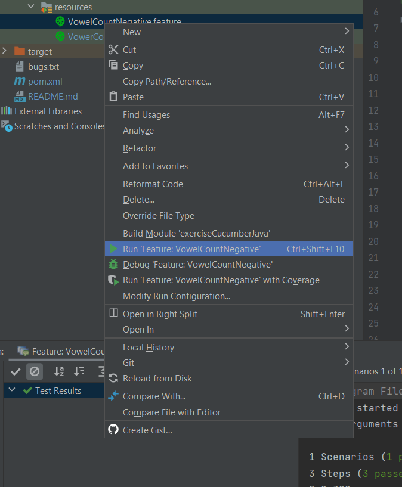

### How to run tests
The definitions are in the `src/test/java/StepsDefinitions.java` file. All the methods used for testing are placed there.
The tests are located in _src/test/resources/_, both tests have the `.feature` extension.
To run, simply right click the name of the file and select to run the test file. 

### QA Tasks:
1. Review the user story and prepare a list of questions/ assumptions.
- Why do we need consonant count?
- What's the business value of having a maximum of 4 strings?
- Do we accept other input types (int, special characters)?
- Do we want to support other languages?
---
2. Review the code and provide feedback/ improvements.
- comments were left in the code (I know, github knows code review and the process, at the time, it was faster to leave them there, I tried not to spend too much time, as per your time limit suggestion.)
- I've done some improvements in the code, as required to do the tests and fulfill the other tasks
---
3. The application now returns the number of consonants and vowels
---
4. Some happy flows added, they run, one caught a bug (currently failing at 4 documents)
I got the test for the bonus: _Bonus points if you can add failing test cases for the bugs you find._
---
5. Bugs can be found in the `bugs.txt` file. Some of them corrected in the application.
